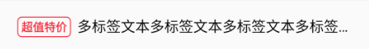
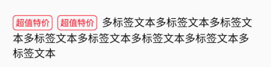
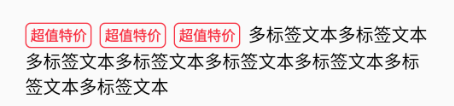

# 多标签文本  

## 单标签文案固定且文本只有一行 / 多标签文案固定且个数及颜色不可变且文本只有一行  

>TextView(DrawableLeft)  

>ImageView+TextView  

>TextView+TextView  

>TextView(SpannableStringBuilder--->ImageSpan)  

>TextView+(XML-->View-->Drawable--->SpannableStringBuilder--->ImageSpan)  

## 单标签文案不固定且文本只有一行  

>TextView+TextView  

>TextView+(SpannableStringBuilder--->ImageSpan)  

>TextView+(XML-->View-->Drawable--->SpannableStringBuilder--->ImageSpan)  

## 单标签文超过1行 / 多标签个数及颜色可变  

>TextView(SpannableStringBuilder--->ImageSpan)  

>TextView+(XML-->View-->Drawable--->SpannableStringBuilder--->ImageSpan)  

## 截图  

    